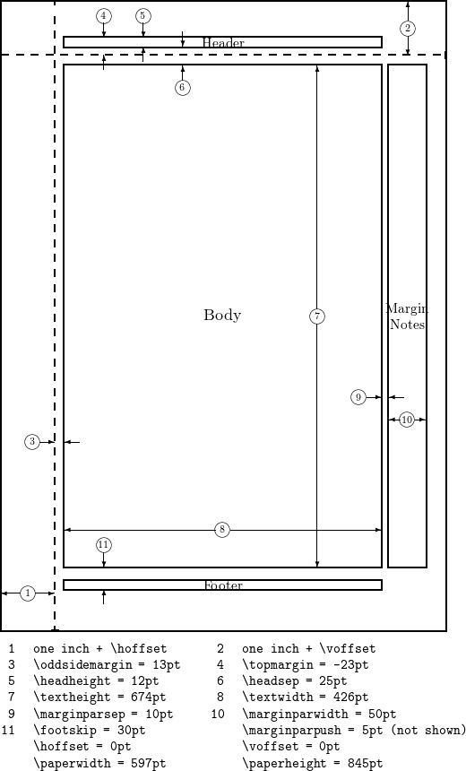

# "official" docs or cheatsheets
- reference: [Comprehensive TeX Archive Network](https://ctan.org/) and a [directory](https://tug.ctan.org/) to file browse, check out even [info](https://tug.ctan.org/info/) for bunch of random stuff
- cheat sheets
    - https://katex.org/docs/supported.html
    - [Every friggen symbol](https://tug.ctan.org/info/symbols/comprehensive/symbols-a4.pdf)
    - [symbols in a wiki but its incomplete](https://oeis.org/wiki/List_of_LaTeX_mathematical_symbols)
- issues / bugs
    - https://github.com/KaTeX/KaTeX/issues/2003
- guides / courses
    - [lshort--the bible](https://www.ctan.org/tex-archive/info/lshort/) for lots of lanugages which end up hosting [pdfs like this](https://mirror.las.iastate.edu/tex-archive/info/lshort/english/lshort.pdf)
    - [overleaf intro guide, see left hand side](https://www.overleaf.com/learn/latex/Learn_LaTeX_in_30_minutes) but dont pay for it

# MY Cheat Sheet
- $% invisible comment$ - comment (invisible in presentation)
- $\text{visible comment}$ - comment (invisible in presentation)
- $X$ - ascii upper
- $\mathrm{X} \rm{X}$ - ascii upper in roman style non-italic
- spaces
    $$
    % \url{https://tex.stackexchange.com/a/74354}{source} \\
    \mathrm{newline}
    \newline
    \text{also newline} \\
    a~ b \\  % nbsp
    a\, b  \\  % 3/18 of \quad (= 3 mu)
    a\: b  \\  % 4/18 of \quad (= 4 mu)
    a\; b  \\  % 5/18 of \quad (= 5 mu)
    a\! b  \\  % -3/18 of \quad (= -3 mu)
    a\quad b \\  % 18 mu
    a\qquad b \\  % 36 mu
    a\medspace b \\
    a\negmedspace b \\
    a\thickspace b \\
    a\negthickspace b \\
    a\hphantom{15}b \\
    \rm{weird stuff happens with \backslash{rm} }
    hello
    $$
                    wild stuff
      only two spaces comments under the thingy (only happens when tabs are 4 spaces)
        four spaces and you get a small indent like this
                    hello?
- $n ~ \mathrm{n} ~ \text{n} $ - ascii lower, all 3 styles separated by nbsp non breaking space
- $\neq, \leq, \geq \equiv \approx \cong \simeq \sim \propto \parallel$ - [comparators](https://www.geeksforgeeks.org/relational-operators-in-latex/)
- $\Zeta ~ \zeta$ - greek
- $e \pi i$ - constants
- $Y = Ax + b$ - formula equation
    $$
    \begin{equation}
    % \label{eu_eqn}  % no support for labels  % https://github.com/KaTeX/KaTeX/issues/2003
    \begin{split}
        A & = \frac{\pi r^2}{2} \\
        & = \frac{1}{2} \pi r^2
    \end{split}
    \end{equation}
    % The beautiful equation \ref{eu_eqn} is known as the Euler equation.  % or \ref  % https://github.com/KaTeX/KaTeX/issues/2003
    $$
- $1 + 2 - 3 * 4 /    5 ^ {(6)} \times \div \pm \plusmn$ - pemdas plus minus
- $\bar{X} \hat{X}$ - bar    hat
- $X_{(i + 1)}$ - subscript underscript
- $X^{(i + 1)}$ - superscript upperscript
- $\frac{1 + 1}{n - 1}$ - fraction
- $1 \over {2}$ - alternate fraction
- $\sum_{i=1}^n$ - sum small
- $\displaystyle\sum_{i=1}^{n}( \bar{a} + \hat{b}^{i}_{i} )$ - sum big
- $\displaystyle\prod_{i=1}^n \displaystyle\bigwedge_{i=1}^n  \displaystyle\bigcup_{i=1}^n  \displaystyle\bigvee_{i=1}^n  \displaystyle\bigcap_{i=1}^n  \displaystyle\bigoplus_{i=1}^n  \displaystyle\int_{i=1}^n  \displaystyle\oint_{i=1}^n$ - other sums, sum logic, sum conjunction, sum disjunction, sum union, sum disunion, product, etc.
- $\mathbf {p} \text{ vs. } p \mathbf {\text{ doesnt work on text }} \text{text}$ - bold
- displaystyle just means alternate display style
    $$
    a_0+{1\over a_1+
        {1\over a_2+
            {1 \over a_3 +
            {1 \over a_4}}}}
    $$
    > vs
    $$
    a_0+{1\over\displaystyle a_1+
        {1\over\displaystyle a_2+
            {1 \over\displaystyle a_3 +
            {1 \over\displaystyle a_4}}}}
    $$
- $\lim_{x\to\infty} f(x) \displaystyle\lim_{x\to\infty} f(x)$ - limit
- $\iiint^{E}_{V} \mu(u,v,w) \,du\,dv\,dw \qquad \displaystyle\iint^{10}_{13} \frac{\partial{x}}{\partial{y}}$ - integral
- $\sqrt{4i} \space \sqrt[3]{4i} \space \sqrt[n]{4i}$ - roots
- $\log(10) \qquad \log_{10}(10) \qquad \log_{(e+1)}(10) \qquad \ln(e)$ - logs
- $\inf \infty \R \mathbb{R} \mathbb{C} \neg \iff \implies \cong \angle \triangle \overrightarrow{\rm AB} \partial \arccos \arctan \cosh \dots $ - symbols infinity, sets, negate, iff if only if congruence, elipses, dots
- [logic](https://en.wikipedia.org/wiki/List_of_logic_symbols)
    - operators: $\neg \lnot \lor \land \oplus $
    - sayings: $\exists \nexists \forall \implies \iff \equiv$
    - misc: $\veebar \vee \parallel \bot \top \rightarrow \longrightarrow \Rightarrow  \Longrightarrow \leftarrow \longleftarrow \Leftarrow \Longleftarrow \leftrightarrow \Leftrightarrow \longleftrightarrow \Longleftrightarrow$
    - contradiction: $\Rightarrow\!\Leftarrow$
- [set](???)
    - operators: $$
    - sayings / isms: $\in$
- divides / indivisible: $\mid \nmid$
- $\backslash \$5.00 \# \% \& \~{a} \_ \^{b} \{ \}$ - escapes [via so](https://stackoverflow.com/a/5422751)
- number theory
$$
\begin{aligned}
\mathbb{P} & \text{ - prime}      \\
\mathbb{W} & \text{ - whole}      \\
\mathbb{N} & \text{ - natural}        \\
\mathbb{Z} & \text{ - integers}       \\
\mathbb{I} & \text{ - irrational}     \\
\mathbb{Q} & \text{ - rational}       \\
\mathbb{R} & \text{ - real}       \\
\mathbb{C} & \text{ - complex}        \\
\mathbb{H} & \text{ - quaternions}        \\
\mathbb{O} & \text{ - octonions}      \\
\mathbb{S} & \text{ - sedenions}      \\
\end{aligned}
$$
- cases
    $$
    CE(p, y) =
        \begin{cases}
                -\log(p)            & \text{if } y = 1 \\    % & is your "\tab"-like command (it's a tab alignment character)
                -\log(1-p)        & \text{otherwise.} \\
                0        & \text{otherwise.} \\
        \end{cases}
    $$
- best alignment method I know (2 "columns", one aligned left, another aligned left starting center )
    $$
    \begin{aligned}
        & y = f(x) = \alpha \plusmn \beta{x}  && \text{after the double amps is all left aligned TO the center } \\
        & \text{text on left} && \text{text on right} \\
        & y = f(x) = \alpha \plusmn \beta{x}   \\
        \text{if you type here, you push things }  \\
        & && \text{empty on the left} \\
        & \text{empty on the right} &&  \\
    \end{aligned} \\
    $$
    > the reason you want to use "aligned" rather than "align*" is "align*" does something funk and declares a new "math space" in latex itself. so it renders correctly in vscode, but in pandoc conversions, pdflatex chokes.
    >
- previous best alignment method I know (2 "columns", one aligned left, another aligned left starting center )
    $$
    \begin{align*}
        & y = f(x) = \alpha \plusmn \beta{x}  && \text{after the double amps is all left aligned TO the center } \\
        & \text{text on left} && \text{text on right} \\
        & y = f(x) = \alpha \plusmn \beta{x}   \\
        \text{if you type here, you push things }  \\
        & && \text{empty on the left} \\
        & \text{empty on the right} &&  \\
    \end{align*} \\
    $$
- n-col
    $$
    \begin{align*}
        & \text{what happens} \\
        && \text{what happens} \\
        &&& \text{what happens} \\
        &&&& \text{what happens} \\
        % just one per line
        &&& \text{3} \\
        &&&& \text{4} \\
        && \text{2} \\
        & \text{1} \\
        % multi one per line out of order?
        & \text{1} && \text{2} &&& \text{3} &&&& \text{4} \\
        \text{0} \\
        & \text{1} &&&& \text{4} \\
    \end{align*}
    $$
- jank 3-col
    $$
    \begin{align*}
        \text{left but coming out of the center} & \text{the actual center} && \text{right from center} \\
    \end{align*} \\
    $$
- multiline center aligned
    $$
    \begin{aligned}
    p & = \hbar k \\
    E & = \hbar \omega \\
    \end{aligned}
    $$
- freeform alignment
    $$
    \begin{align*}
    A = 1 \\
    A = &1 \\
    A& = 1 \\
    A& = &1 \\
    &A= 1 \\
    &A &= 1 \\
    &A &= &1 \\
    \end{align*}
    $$
- formula definition alignment (numbering implicit)    TODO
    $$
    \begin{alignat}{7}
    10& x + &3 &y = 2 \\
    3& x + &13 &y = 4 \\
    &A &= &\text{has} \\
    &\neg{B} &= &\text{not has} \\
    &B &= &\text{test positive} \\
    &\neg{B} &= &\text{not test positive}
    \end{alignat}
    $$
- diagram
    $$
    \begin{CD}
    A @>a>> B \\
    @VbVV @AAcA \\
    C @= D
    \end{CD}
    $$
- $A\newline{A}$    - A newline A
- $A\\{A}$    - A newline A (version 2)
- markdown table with latex in there
        | header | header |
        | --- | --- |
        | $\Rho(A\|B)$ | $\text{escapes usually work well in this area}$ |
- array / matrix
    $$
    A_{2\times2} = \left[
        {
            \begin{array}
                {cc}
                a_{11} & a_{12} \\
                a_{21} & a_{22} \\
                a_{31} & a_{32} \\
            \end{array}
        }
    \right]
    $$
- matrix / pmatrix / parenthetical matrix
    $$
    A_{2\times2} =
        {
            \begin{pmatrix}
                a_{11} & a_{12} & a_{13} & a_{14} \\
                a_{21} & a_{22} & a_{23} & a_{24} \\
                a_{31} & a_{32} & a_{33} & a_{34} \\
                a_{41} & a_{42} & a_{43} & a_{44} \\
                a_{51} & a_{52} & a_{53} & a_{54} \\
            \end{pmatrix}
        }
    $$
- $\vdots \cdots \ddots$ - elipses
-  which comes from [Overleaf](https://www.overleaf.com/learn/latex/Page_size_and_margins)
    - ez recomend:
        ```tex
        \documentclass{article}
        \usepackage{blindtext}
        \usepackage{geometry}
        % this shit right here.
        \geometry{
            a4paper,
            total={170mm,257mm},
            left=20mm,
            top=20mm,}
        \begin{document}
        \section{Some dummy text}
        \blindtext[10]
        \end{document}
        ```
- janky proof but it looks ok:
    $$
    \begin{aligned}
    \text{let } p &: it is hotter than 100 degrees today. \\
                q &: the pollution is dangerous. \\
    \\
    & p \lor q \\
    & \lnot p \\
    \hline
    & \blacksquare q \\
    \end{aligned}
    $$
